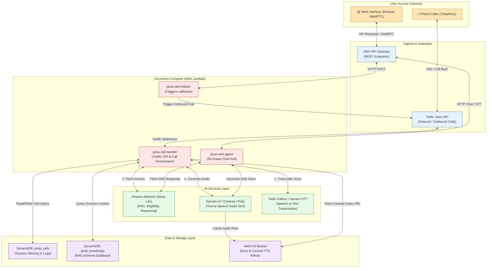

# Architecture Diagram Generation Prompt

This file contains the prompt and code to generate the architecture diagram for JanAI. You can copy and paste the prompt below into any AI diagramming tool (like **Eraser.io**, **Mermaid Live Editor**, or **ChatGPT/Claude**) to generate a clean, professional architecture diagram.

---

## 🎨 Option 1: Mermaid.js Code (Copy-paste directly to [Mermaid Live Editor](https://mermaid.live))



---

## ✍️ Option 2: AI Tool Text Prompt (Copy-paste into **Eraser.io** or **ChatGPT**)

```text
Generate a clean, high-level architecture diagram for a voice-powered AI system named "JanAI".

Use a professional, modern layout (left-to-right or top-to-bottom flow) with standard component shapes and harmonious pastel colors. Group the components into 4 distinct layers:

1. ACCESS LAYER (User Channels):
   - "Phone Caller (Cellular / Telephony)"
   - "Web Browser (Live WebRTC Audio & Chat Widget)"

2. GATEWAY & INGRESS:
   - "Twilio Voice API" (Handles cellular inbound/outbound connection)
   - "AWS API Gateway" (Handles REST endpoint routing and Web CORS)

3. ORCHESTRATION LAYER (Serverless Compute):
   - "AWS Lambda: janai-call-initiator" (Triggers outbound callback calls)
   - "AWS Lambda: janai-call-handler" (Main orchestrator processing incoming calls, TwiML IVR, and responses)
   - "AWS Lambda: janai-web-agent" (Handles web-centric avatar conversation & web STT/TTS)

4. COGNITIVE & DATA LAYER:
   - "STT (Twilio Native / Sarvam AI)"
   - "LLM (Amazon Bedrock Nova Lite / OpenAI fallback)"
   - "TTS (Sarvam AI / Cartesia / Polly fallback)"
   - "Amazon DynamoDB" (Stores call history and RAG knowledge vectors)
   - "Amazon S3" (Stores source docs and cached speech audio wavs)

Ensure the connections show:
- Inbound/Outbound cellular connections routing through Twilio Voice API.
- Web browser calling AWS API Gateway.
- The Call Handler Lambda orchestrating STT translation -> querying LLM -> synthesizing TTS audio -> returning TwiML response.
- Read/Write operations from Lambdas to DynamoDB and S3 for persistence and caching.

Keep it simple, avoid overlapping lines, and make it easy to understand for developers and stakeholders.
```
