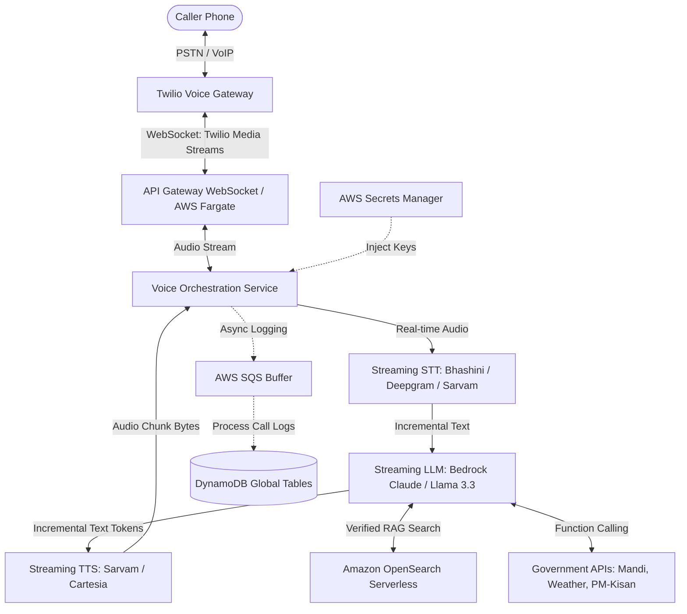
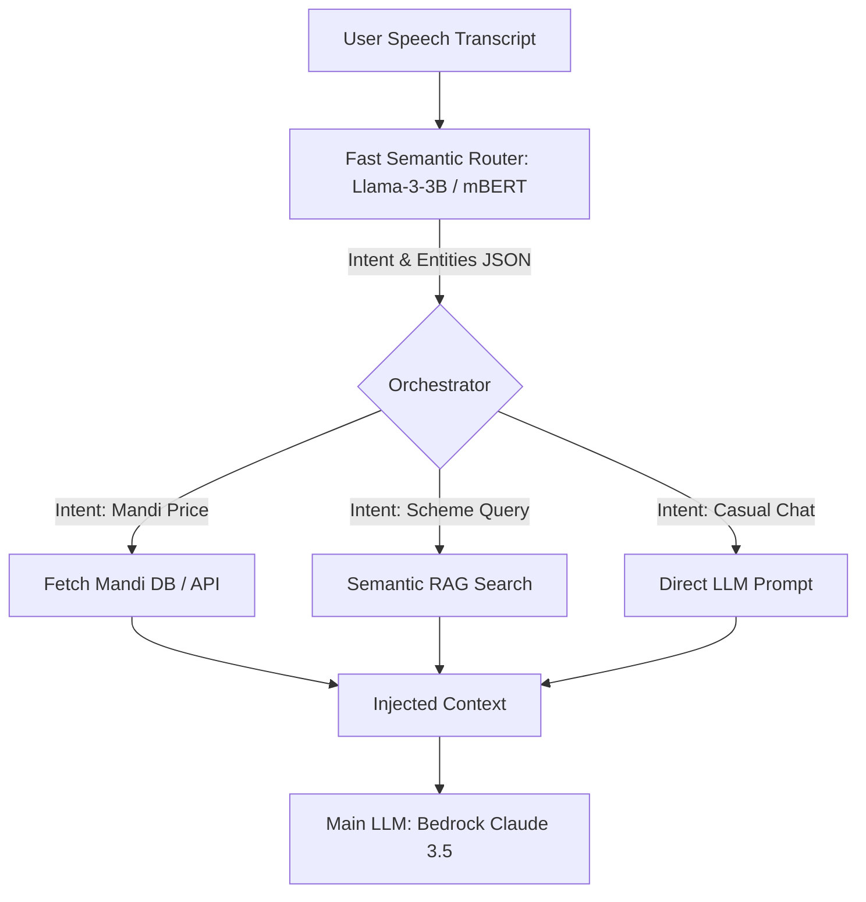
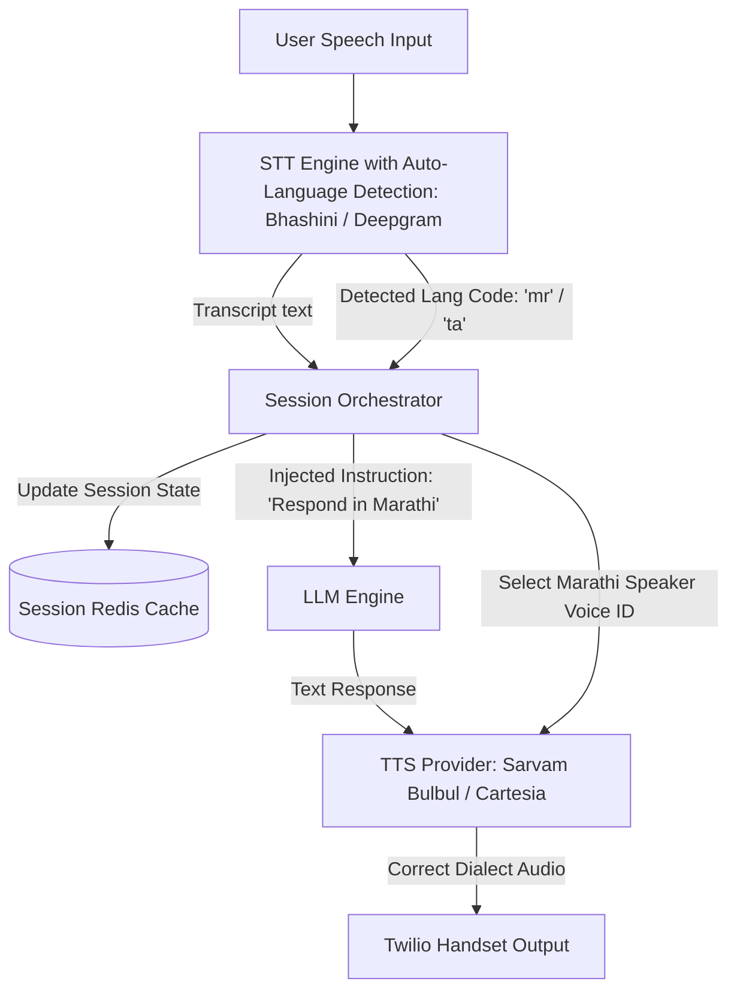

# JanAI — Production Readiness Guidance Report
This document provides a comprehensive engineering roadmap and architecture guide to take **JanAI (वाणीसेवा)** from its current MVP/hackathon state to a highly available, sub-second latency, compliant, and secure enterprise-grade platform.

---

## 📌 Executive Summary
JanAI's core mission is to bring voice-first AI services to the 500M+ digitally excluded citizens of India. For this service to be effective at scale, it must meet several strict operational criteria:
1. **Low Latency**: Phone call turn-around time must be **under 1.5 seconds** (current MVP is 3-5 seconds due to sequential STT ➔ LLM ➔ TTS ➔ Play stages).
2. **Resilience**: The system must handle high concurrent call volumes and degrade gracefully when external voice/AI APIs fail.
3. **Data Compliance**: Adhere strictly to India's **Digital Personal Data Protection (DPDP) Act 2023** concerning user consent, PII protection, and voice data.
4. **Code Maintainability**: Break down the massive 3,160-line monolith Lambda ([handler.py](file:///d:/Downloads/JanAI/JanAI/lambdas/call_handler/handler.py)) into clean, specialized microservices.
5. **Interruption & Background Noise Handling**: Implement robust Voice Activity Detection (VAD) and immediate audio-clearing on user barge-in to enable natural conversational flow under noisy conditions.

---

## 🏗️ Production Target Architecture
The primary architectural shift is moving from **sequential polling-based webhooks** to **real-time bi-directional streaming** over WebSockets.

### Mermaid Architecture Flow

---

## 🛠️ Phase-by-Phase Production Roadmap

### Pillar 1: Code Refactoring (Deconstruction of the Monolith)
The current [handler.py](file:///d:/Downloads/JanAI/JanAI/lambdas/call_handler/handler.py) is a monolith performing routing, authentication, Connect flows, voice processing, database lookups, and admin actions. 

#### Recommended Action Items:
- **Segregate Lambdas by Responsibility**:
  - `incoming-call-lambda`: Handles initial Twilio voice webhooks and handles the IVR logic.
  - `voice-session-lambda`: Manages the active call session, WebSocket initialization, and language switching.
  - `rag-query-lambda`: Decoupled microservice that takes a text query and returns vector matches.
  - `user-profile-lambda`: Manages `/profile` routes, SMS notifications, and preference persistence.
  - `admin-console-lambda`: Handles admin operations, RAG verification interfaces, and metrics.
- **Implement Clean Architecture (DDD)**:
  - Standardize interfaces for TTS, STT, and LLM providers. Wrap them in adapters (e.g., `SarvamTTSAdapter`, `PollyTTSAdapter`) to allow zero-downtime hot-swapping.
  - Introduce dependency injection so database layers can be tested locally using DynamoDB Local or mock environments.

---

### Pillar 2: Sub-Second Latency Optimization (Streaming Pipeline)
Sequential HTTP APIs are the main source of latency in the current setup. Moving to a streaming model reduces the Time-to-First-Audio (TTFA) to under 1.5 seconds.

#### Recommended Action Items:
- **Twilio Media Streams**: Use Twilio's `<Connect><Stream>` TwiML verb. This opens a bi-directional WebSocket connection sending raw 8kHz mulaw audio chunks.
- **WebSocket Gateway**: Run a persistent container fleet on **AWS ECS Fargate** or use **AWS AppSync/API Gateway WebSockets** to handle the connection. Fargate is recommended for voice processing because it avoids Lambda cold starts and supports long-running connections (up to Twilio's 10-minute call cap).
- **Streaming STT, LLM, and TTS**:
  - Feed the audio chunks directly to a streaming STT (e.g., Deepgram or Bhashini WebSocket API).
  - Pipe the text transcripts immediately to Bedrock/OpenAI using stream-response mode (`response_stream`).
  - Send the LLM text tokens, as they arrive, to a streaming TTS (e.g., Cartesia or Sarvam Bulbul Streaming).
  - Stream the resulting audio bytes back to Twilio.
- **Audio Pre-Heating**:
  - Pre-generate static MP3/WAV greetings (like language selection prompts, system busy fallbacks) and store them in S3. Use Twilio's local play capabilities instead of calling TTS.
  - Cache frequently requested dynamic values (e.g., daily weather summaries, popular mandi prices) in **Amazon ElastiCache (Redis)**.

---

### Pillar 3: Scalable Verified RAG & Real-Time Data
A production RAG database must support rapid semantic search and rigorous verification of critical information.

#### Recommended Action Items:
- **Migrate to Vector Databases**: Replace the custom DynamoDB vector scans with **Amazon OpenSearch Serverless** or **pgvector in Aurora PostgreSQL**. This provides sub-50ms semantic search with support for metadata filters (e.g., filtering by language or state).
- **RAG Verification Portal**: Build a dashboard on the React frontend using the `AdminPage.jsx` backend endpoints, allowing:
  - Domain experts (doctors, KVK officers) to review and sign off on flagged entries (`verified=true`).
  - Automatic drift detection scripts to crawl government portals and trigger alerts when official schemes change.
- **API Cache & Fallback**:
  - The Agmarknet API (for mandi prices) can occasionally be slow or down. Set up an EventBridge schedule to scrape and store daily prices in a fast local cache database (DynamoDB or Redis) every morning at 10 AM, rather than querying the external API live during the call.

---

### Pillar 4: Privacy, Security, and DPDP Compliance
Voice data and phone numbers represent highly sensitive personal identifiable information (PII).

#### Recommended Action Items:
- **DPDP Act (India) Compliance**:
  - **Explicit Consent**: Play a 3-second consent prompt in the user's selected language during the first call (*"This service uses AI to help you and stores voice records to improve response quality. To agree, press 1..."*). Record consent in the `janai-users` table.
  - **Data Minimization**: Store only hashed phone numbers (`_hash_phone`) in logs and distress databases. Store raw numbers only in Twilio's secure environment or a separate highly restricted table encrypted using **AWS KMS Customer Managed Keys (CMK)**.
- **Secret Management**: Move all sensitive keys (like `SARVAM_API_KEY`, `TWILIO_AUTH_TOKEN`, `OPENAI_API_KEY`) out of environment variables and store them in **AWS Secrets Manager** with automatic rotation.
- **Webhook Security**: Validate Twilio's webhook signatures (`X-Twilio-Signature`) in your Lambda entrypoint to prevent unauthorized third parties from spoofing incoming voice endpoints and racking up compute bills.

---

### Pillar 5: Background Noise & Conversational Interruption (Barge-In)
For a conversational AI voice assistant to feel friendly and human, it must support **barge-in** (letting the user interrupt the agent while speaking) and handle high **background noise** without false triggering or breaking the dialogue loop.

#### 1. Real-Time Conversational Interruption (Barge-In)
- **Twilio Stream Clearing**: In a bi-directional WebSocket streaming architecture, when the user speaks, the server receives audio packets. If Voice Activity Detection (VAD) detects user speech, the backend must instantly send a `clear` command to the Twilio stream connection. This tells Twilio to flush its playback buffer and stop playing the current agent audio immediately.
- **Backchanneling vs. Interruption Classification**:
  - *The Problem*: Users often say short words like "yes", "okay", "haan", or "achha" just to show they are listening (backchanneling), without intending to cut the agent off. If every "haan" causes the agent to stop and generate a new response, the conversation feels disjointed.
  - *The Solution*: Build a classifier on the streaming server. If the STT transcript is short (e.g., <= 2 words or matches a backchannel dictionary like `["yes", "okay", "haan", "achha", "shukriya"]`), the system should **not** interrupt the flow. Instead, it should immediately resume playing the TTS audio where it left off, or avoid sending the `clear` signal in the first place by using a longer VAD trigger delay for short utterances.
- **Friendly Conversational Resumes**:
  - When the agent continues speaking after being interrupted by a simple backchannel, prepend natural conversational fillers (e.g., "तो हाँ,..." or "हां, जैसे मैं बता रहा था...") to make the transition sound fluid and human-like.

#### 2. Adaptive Context & History Truncation (AI Interruption Adaptation)
For the AI to adapt dynamically to mid-conversation interruptions, it must understand *exactly what the user heard* before they interrupted, and immediately pivot its cognitive context rather than completing its previous thought.
- **Dialogue History Truncation**:
  - *The Problem*: In a typical LLM call, if the LLM generates a long paragraph, the conversation history stores the *entire* generated paragraph. However, if the user interrupted after the first sentence, the user only heard the first sentence. If the LLM history contains the full paragraph, subsequent reasoning will assume the user has information they never actually received.
  - *The Solution*: Track the playback progress of the generated TTS audio stream. If the stream is cleared at time $T$, map that timestamp to the corresponding word index in the text prompt. **Truncate the assistant's response** in the DynamoDB history to save only what was actually spoken out loud.
- **Intent Pivot & Generation Cancellation**:
  - When an interruption occurs, immediately close/cancel any active LLM generation process or TTS generation task for the previous turn to save tokens and compute costs.
  - Inject the user's interruption text into the LLM prompt immediately. If the user changed the topic (e.g. *"no wait, tell me about mandi prices instead"*), the LLM must acknowledge the shift ("Oh, sure! Let's check wheat prices...") instead of continuing or wrapping up the old topic.
- **Interruption Context Tagging**:
  - For the next LLM prompt, append a metadata flag indicating that the user interrupted, e.g., `(User interrupted the assistant mid-sentence while speaking)`. This tells the model to react adaptively, apologize for speaking too long, or immediately address the user's new request.

#### 3. Background Noise Handling
- **Tuning VAD for Noise**: Use a robust deep-learning VAD (like **Silero VAD**) rather than simple energy-based VADs. Silero can accurately distinguish human speech from farm background noise, wind, and street traffic.
- **Twilio Speech Models**: If using Twilio's sequential `<Gather>` in standard call scenarios, configure the `SpeechModel` parameter to `experimental_conversational` or `phone_call`. These models employ advanced server-side filters designed to reduce cellular channel hiss and background acoustics.
- **Speech Suppression Filters**: Pass WebSocket audio streams through a lightweight real-time noise suppression wrapper (such as **RNNoise** or **WebRTC NS**) prior to transcription. This strips static noise and clarifies formatting for the STT engine.
- **Empty / Garbage Transcript Filters**: If background noise gets transcribed as gibberish or empty text, short-circuit the LLM processing at the Lambda/orchestration layer. Play a polite, context-aware prompt like: *"माफ़ कीजिये, हमें पीछे शोर के कारण आपकी आवाज़ साफ़ नहीं आई। क्या आप फिर से कहेंगे?"* (Sorry, we couldn't hear you clearly due to background noise. Could you please say that again?) instead of passing garbage text to the LLM.

---

### Pillar 6: Resilience, Multi-Region Deployment, and Devops
A national utility system must achieve 99.9% uptime.

#### Recommended Action Items:
- **Multi-Region Disaster Recovery**:
  - Deploy the infrastructure across two AWS regions (e.g., `ap-south-1` Mumbai and `ap-southeast-1` Singapore).
  - Use **DynamoDB Global Tables** for multi-region active-active database replication.
  - Configure Route 53 with health check failovers to route WebSockets traffic.
- **Infrastructure as Code (IaC)**: Rewrite the infrastructure deployment setup using **Terraform** or the **AWS CDK** for automated, clean provisioning.
- **Circuit Breakers**: Implement the circuit breaker pattern (using libraries like `pybreaker` or AWS App Mesh) for all external APIs. If Sarvam TTS is experiencing 5xx errors, automatically route requests to Amazon Polly or ElevenLabs without dropping the active call.
- **Observability**:
  - Track calls using **AWS X-Ray** to identify latency bottlenecks between services.
  - Set up CloudWatch alarms for 5xx errors on Lambda and high latency on STT/TTS calls.

---

### Pillar 7: Production-Grade Multilingual Intent & Entity Detection
In the current MVP, intent detection is split between static python keywords (for agent persona routing) and LLM-generated tag suffixes (e.g., `[FETCH_DATA]`, `[WEB_SEARCH]`). 

While simple, this method has significant limitations for production scale:
1. **Double LLM Round-Trips**: Forcing the LLM to output a tagging token first, stopping generation, fetching data, and starting a new LLM generation takes **3+ seconds** of latency.
2. **Keyword Fragility**: Rural Indian callers use diverse dialects and code-mixed words (e.g., Hinglish, Tanglish) that static string lookups will miss or misclassify due to spelling variations and STT transcription glitches.

#### Recommended Production Architecture:

#### 1. Pre-Execution Semantic Router (Latency Reduction)
- **How it works**: Instead of invoking the main conversational LLM to detect if data is needed, run a small, specialized NLU classifier (like a fine-tuned **XLM-RoBERTa** model, **Rasa NLU**, or a fast utility LLM like **Bedrock Nova Micro**) *prior* to calling the primary dialogue model.
- **Async Data Pre-Fetching**: The router classifies the user's intent in **< 100ms**.
  - If the intent is `check_mandi_price`, the backend fetches the mandi database records immediately.
  - If the intent is `scheme_query`, it runs the semantic vector search in parallel.
  - The retrieved context is injected into the prompt of the main LLM on its *first* call, reducing voice response latency by eliminating the need for a secondary retrieval turn.

#### 2. Multilingual Named Entity Recognition (NER)
- **Indian Language Entity Parsing**: Callers speak with mixed regional vocabularies. The NLU layer must parse out specific entities:
  - **Commodity/Crop**: `wheat`, `gehu`, `lahsun` (garlic), `pyaaz` (onion).
  - **Location**: Districts, pin codes, or states (*"Varanasi"*, *"Nashik"*).
  - **Identity numbers**: Aadhaar numbers, ration cards.
- **Implementation**: Deploy custom entity matching dictionaries or a multilingual SpaCy pipeline on the streaming server to extract and normalize these inputs (e.g., converting "gehun" or "gahu" into standard search terms) before querying database APIs.

#### 3. Low-Confidence Fallback & Clarification Loops
- If the intent classifier returns a confidence score below a threshold (e.g. `< 0.65`), the system should immediately trigger a clarification turn instead of passing garbage data to the LLM. 
- Play a targeted voice prompt: *"क्या आप मंडी भाव जानना चाहते हैं या सरकारी योजना के बारे में?"* (Do you want to know the market price or about a government scheme?) to guide the user back into a structured dialogue flow.

---

### Pillar 8: Dynamic Multilingual Language Switching
In India, callers frequently switch languages mid-sentence (code-mixing) or change languages mid-conversation (e.g., starting in Hindi, then switching to Marathi or Tamil). 

#### The Problem with Static Systems:
If a user registers as a Hindi speaker, standard platforms lock the Twilio STT to `Language="hi-IN"` and the TTS to a Hindi voice model. If the user suddenly asks a question in Marathi, the STT will transcribe the Marathi speech using Hindi phonemes, resulting in gibberish transcripts and breaking the dialogue flow.

#### Target Production Architecture:

#### 1. Automatic Language Detection (ALD) at STT Level
- **Multilingual WebSockets**: Use a streaming speech-to-text service that supports dynamic language detection on the fly (such as **Bhashini's Voice API**, **Deepgram Multilingual**, or **Sarvam Saaras v3**).
- **Code-Mix Model Tuning**: Configure the STT engine's model mode to `codemix` (e.g. Hindi-English or Tamil-English). This allows the system to recognize combined terms (e.g., *"Mera bank passbook upload nahi ho raha"* / My bank passbook isn't uploading) without failure.

#### 2. Session Orchestration & State Tracking
- When the STT returns a transcript with a detected language code (e.g., `detected_language: "mr"`) that differs from the active language, the system should trigger a state update.
- **Write-Through Cache**: Immediately update the active language key (`current_lang: "mr"`) in the fast Redis/DynamoDB session state for the active call session ID.

#### 3. Cognitive & LLM Adaptation
- Pass the language switch instruction as a system override context to the LLM for the current turn: `(System Notification: The user has switched languages and is now speaking Marathi. Respond strictly in Marathi. Ignore any previous language commands.)`.
- *Note*: Frontier LLMs (Claude 3.5 Sonnet / Llama 3.3 70B) are natively polyglot and will automatically respond in the language they are addressed in once they receive the switch signal.

#### 4. Dynamic TTS Speaker and Voice Selection
- **The accent problem**: If the LLM returns Marathi text but the system continues to use a Hindi TTS speaker voice (e.g., `arya` default Hindi configuration), the audio output will sound like a non-native speaker reading Marathi, which feels unnatural and breaks trust.
- **Dynamic Mapping**: The orchestrator must dynamically map the text response to the corresponding speaker parameters in the TTS API call:
  - If `current_lang` is `"mr"`, route the payload to Sarvam's Marathi speaker (`manisha` / `arya` mapped to `mr-IN` code) or Cartesia's Marathi voice ID.
  - If `current_lang` is `"ta"`, route to Tamil speaker (`vidya` / `ta-IN` voice ID).

---

## 📈 Summary Checklist for Production Transition

| Category | MVP / Hackathon State | Production Target State | Effort | Priority |
| :--- | :--- | :--- | :--- | :--- |
| **Architecture** | Monolithic Lambda | Specialized Microservices (FastAPI / Serverless) | Medium | High |
| **Voice Flow** | Sequential HTTP Polling | Bi-directional WebSockets (Twilio Media Streams) | High | Critical |
| **Data Privacy** | Simple SHA hashing | KMS-encrypted PII + IVR DPDP Consent Flow | Medium | Critical |
| **Secrets** | `.env` variables | AWS Secrets Manager (rotated keys) | Low | High |
| **RAG Vector DB** | DynamoDB vector queries | Amazon OpenSearch Serverless / pgvector | Medium | High |
| **Real-time Data** | Live external API calls | Cached endpoints (Redis / DynamoDB) | Low | Medium |
| **Resilience** | Inline Python try-except | Circuit Breakers + Multi-Region Active-Active | High | Medium |
| **Barge-in & Noise** | No backchannel logic, raw audio to STT | WebSocket VAD + Twilio clear events + Silero VAD + RNNoise | High | Critical |
| **Intent Detection** | Static keyword search + LLM tags | Pre-execution Semantic Router + Multilingual NER + Async pre-fetching | Medium | High |
| **Language Switch** | Locked per-call via manual choice/OTP | Streaming STT Auto-Language Detection (ALD) + Dynamic TTS Voice re-mapping | Medium | High |

---

## 📞 Telephony Infrastructure & Alternatives to Twilio

Twilio is highly reliable and developer-friendly, but its trial constraints and international routing markups in India (costing ₹4.50+ per minute) make it expensive for production scale. Below are the best free, low-cost, or self-hosted alternatives categorized by implementation model:

### 1. Direct WebRTC Calling (100% Free Voice Carriage)
If your users have access to basic internet (via a web browser or a lightweight Android app), you can bypass the traditional telecom network entirely.
- **How it works**: Implement a WebRTC client on your frontend (e.g., in React or Android) that streams audio directly to a backend WebRTC gateway.
- **Backend Gateways**: Use **FreeSWITCH (with mod_verto)**, **Asterisk**, or **AWS Chime SDK**.
- **Cost**: **$0 / minute**. You pay only for your standard server compute (ECS/EC2 bandwidth).
- **Pros**: Completely eliminates phone bills, toll-free number fees, and SIP carrier markups.
- **Cons**: Requires the user to have a data connection (does not work on ₹1,200 basic offline "dabba" feature phones).

### 2. Local Indian Cloud Telephony Providers (Lower Cost SaaS)
For traditional dial-in phone lines within India, local telecom-regulated SaaS providers are significantly cheaper and more compliant than Twilio.
- **Exotel**: The leading enterprise cloud telephony provider in India.
  - **Why it is better**: Direct integrations with Indian carriers (Airtel, Jio, Tata). Local domestic pricing in INR. No international routing markups.
  - **Cost**: Around ₹0.80 - ₹1.20 per minute (compared to Twilio's ₹4.50+).
- **Zadarma / Plivo / SignalWire**:
  - **SignalWire**: Built by the original founders of FreeSWITCH. It is architecturally identical to Twilio but operates at bare-metal wholesale pricing. SignalWire's voice minutes are up to **10x cheaper** than Twilio's.

### 3. Open-Source Self-Hosted Telephony (Wholesale Pricing / No Markup)
To achieve the lowest possible cost per minute while supporting offline feature phones, you can host your own telephony gateway.
- **How it works**: 
  1. Spin up a VPS (e.g. AWS EC2 in `ap-south-1` Mumbai or a cheap DigitalOcean droplet) running **FreeSWITCH** or **Asterisk**.
  2. Purchase a local **SIP Trunk** from an Indian carrier (Airtel, Tata Communications, Jio, or a wholesale provider like Didlogic).
  3. Stream audio in real-time from FreeSWITCH to your AI orchestrator using open-source modules like `mod_audio_fork` or `mod_audio_stream`.
- **Cost**: **₹0.30 - ₹0.50 / minute** (wholesale local SIP carrier rates). No SaaS platform fee.
- **Pros**: Ultimate cost savings at scale, complete control over media stream audio formats, and zero developer sandbox restrictions.
- **Cons**: Requires system administration knowledge to manage and scale the VoIP server.

---

*This guide was generated for the JanAI Development Team to support transition planning. Last updated: July 2026.*
