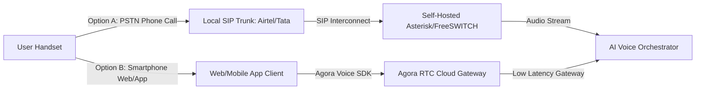
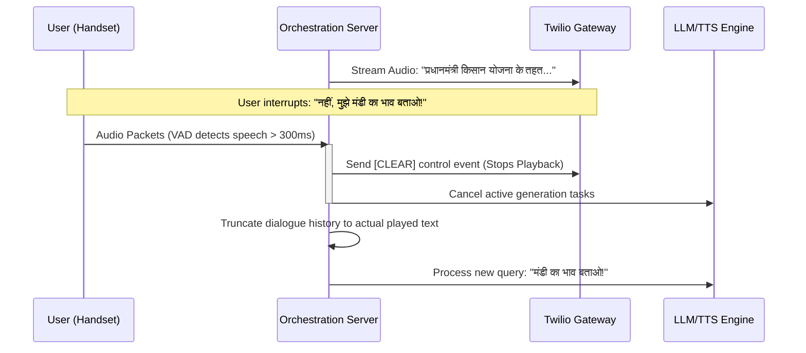

# JanAI: Production-Grade Upgradation & Scaling Proposal

This document outlines a production-level architectural and business blueprint to address the feedback received on **JanAI (वाणीसेवा)**. The goal is to transition the current MVP into a commercial, high-availability, low-latency, and cost-efficient voice-first AI platform for digital inclusion in India.

---

## 📌 1. Revenue Model & Cost Management

To sustain and scale JanAI, we propose a hybrid **B2G (Business-to-Government)**, **B2B2C**, and **Freemium** commercial architecture.

### Revenue Streams
```
               ┌──────────────────────────────┐
               │    JanAI Revenue Platform    │
               └──────────────┬───────────────┘
                              │
         ┌────────────────────┼────────────────────┐
         ▼                    ▼                    ▼
   ┌───────────┐        ┌───────────┐        ┌───────────┐
   │ B2G State │        │ B2B2C NGO │        │ B2C Micro │
   │ Contracts │        │ Microfin. │        │ Subscrib. │
   └───────────┘        └───────────┘        └───────────┘
```

1. **B2G (Government Digital Services)**:
   - **Model**: Licensing the voice AI platform to central and state government bodies (e.g., Ministry of Agriculture, Ministry of Rural Development) to digitize public welfare schemes (PM-Kisan, Ayushman Bharat) as a public utility.
   - **Pricing**: Annual recurring software license based on active users or call minutes, funded by government digital outreach budgets.
2. **B2B2C (Partnership with NGOs & MFIs)**:
   - **Model**: Microfinance Institutions (MFIs), agricultural cooperatives, and social enterprises (e.g., SEWA, PRADAN) pay a subscription or per-minute rate to provide customized advisory services (farming, micro-credits, health tips) to their members.
   - **Pricing**: SaaS model with tiered volume-based calling packages.
3. **Freemium B2C Model**:
   - **Model**: Every user gets **5-10 calls per month free** (subsidized by CSR or government sponsors).
   - **Premium Tier**: For a small monthly fee (e.g., ₹20 - ₹50), power users get unlimited calls, immediate detailed summaries via WhatsApp/SMS, and direct fallback options to human experts (human-in-the-loop).

### Cost Management & Economics
- **Telecom Carriage Cost**: Traditional PSTN calls in India are expensive when routed internationally. By using domestic SIP trunks, telephony carriage costs drop from **₹4.50/min (Twilio)** to **₹0.30 - ₹0.60/min (Local carriers)**.
- **AI Processing Costs**: Decoupling tasks into a **Layered Model Architecture** (described in Section 3) ensures that simple queries use cheap, small models, reserving high-capability LLMs only for complex queries.

---

## 📞 2. Telephony & Calling Platform: Agora Integration

Twilio is highly developer-friendly but incurs international routing markups. For a production launch in India, we must consider domestic and SDK-based options.



### Agora vs. Twilio: Comparative Analysis

| Dimension | Twilio (MVP/SaaS) | Agora (WebRTC/RTE) | Local Indian SIP (Exotel/Airtel) |
| :--- | :--- | :--- | :--- |
| **Primary Channel** | PSTN (Standard phone call) | WebRTC (App/Web-based) | PSTN (Standard phone call) |
| **Cost** | High (₹4.50+/min) | Low ($0.99 / 1,000 mins) | Medium (₹0.50 - ₹1.00/min) |
| **Target Device** | Feature phones & Smartphones | Smartphones & PCs (requires data) | Feature phones & Smartphones |
| **Voice Quality** | Standard Telephony (8kHz) | High-Definition (Up to 48kHz) | Standard Telephony (8kHz) |
| **Noise Handling** | Basic carrier filtering | Built-in AI Noise Suppression | Standard telecom filtering |

### Implementation Recommendation (Hybrid Architecture)
1. **Offline/Feature Phone Users**: Use **Exotel** or a **self-hosted Asterisk/FreeSWITCH server** connected to local Indian SIP trunks (Airtel, Tata, Jio). This allows feature phones to call a domestic toll-free or virtual number at minimal carrier rates.
2. **Online/Smartphone Users (Web & Android App)**: Integrate the **Agora Voice RTC SDK** into the web widget ([JanAIWidget.jsx](file:///d:/Downloads/JanAI/JanAI/website/src/components/JanAIAgent/JanAIWidget.jsx)) and Android app. 
   - Audio is streamed over WebRTC directly to Agora servers, which route it to our backend orchestrator over high-speed networks.
   - **Benefits**: Under 200ms latency, high-definition audio, and automatic noise cancellation (via Agora's built-in AI Noise Suppression - AINS).

---

## 💰 3. Server Cost Ownership & Mitigation

### Who Bears the Infrastructure Cost?
- **Public Outreach (B2G)**: Borne by the government department or department outreach budget.
- **CSR Cohorts**: Corporate sponsors pay for calls originating from targeted rural areas under CSR initiatives.
- **Universal Service Obligation Fund (USOF)**: JanAI qualifies for subsidies under India's USOF, which funds technologies that bridge the rural-urban digital divide.

### Cost Reduction Strategy

```
                          ┌────────────────────────┐
                          │ Incoming Speech Query  │
                          └───────────┬────────────┘
                                      │
                                      ▼
                        ┌──────────────────────────┐
                        │   Fast Semantic Router   │
                        └─────────────┬────────────┘
                                      │
             ┌────────────────────────┼────────────────────────┐
             ▼ (Greeting/Casual)      ▼ (Mandi/Weather)        ▼ (Complex RAG)
     ┌───────────────┐        ┌───────────────┐        ┌───────────────┐
     │  Cached Text  │        │  Redis Cache  │        │ Bedrock Claude│
     │   Response    │        │  (data.gov)   │        │   Inference   │
     └───────────────┘        └───────────────┘        └───────────────┘
     Cost: $0.0000            Cost: $0.0001            Cost: $0.0030
```

1. **Response Caching (TTS & Data)**:
   - **TTS Cache**: Save the S3 URLs of synthesised text segments. Static greetings and standard error messages are retrieved instantly from a Redis key-value store rather than calling the Sarvam/Cartesia TTS API again.
   - **Data Cache**: Instead of calling the Agmarknet Mandi API live on every call (which is slow and rate-limited), run an EventBridge script to scrape and load daily prices into **DynamoDB/Redis** at 10 AM daily.
2. **Layered Model Routing (LLM Compute)**:
   - **Nova Micro / Llama-3-3B**: Used for quick intent routing (<50ms, extremely cheap).
   - **Nova Lite / Llama-3-8B**: Used for conversational filler, greetings, and simple lookups.
   - **Claude 3.5 Sonnet**: Reserved only for complex policy/health queries that require high cognitive reasoning.
3. **Transition to Self-Hosted GPUs at Scale**:
   - As volumes cross 100k calls per day, API bills from third-party STT/TTS providers scale linearly. 
   - Propose hosting open-source models (**Whisper-large-v3** for STT, **Llama-3-8B** for NLU, and **XTTS/MeloTTS** for TTS) on dedicated GPU instances (e.g., AWS EC2 G5/G6 or RunPod). This converts operating costs from **variable per-minute API fees** to **fixed hourly server pricing**, cutting costs by **up to 75%** at high volumes.

---

## 🔊 4. Voice Handling: Noise Reduction & Clarity

Rural calls are often made outdoors, in wind, or in noisy agricultural environments.

```
       ┌──────────────┐     ┌───────────────┐     ┌──────────────┐
       │ Inbound Raw  │ ──> │ RNNoise /     │ ──> │ 8kHz Teleph. │ ──> STT Engine
       │ Audio Stream │     │ WebRTC NS Filter│     │ Acoustic Mod.│
       └──────────────┘     └───────────────┘     └──────────────┘
```

### Actionable Upgrades
1. **Server-Side Audio Preprocessing**:
   - Integrate **RNNoise** (a recurrent neural network noise suppression library) or **WebRTC Noise Suppression (NS)** directly into the streaming server ([app.py](file:///d:/Downloads/JanAI/JanAI/lambdas/streaming_server/app.py)). This strips background engine hum, wind, and farm noises before transcribing.
   - Apply a **High-Pass Filter (HPF)** at 300Hz to remove low-frequency rumble and **Automatic Gain Control (AGC)** to boost low-volume speakers.
2. **Telephony-Optimized STT Models**:
   - Configure the speech recognition engine to use **8kHz narrow-band telephony models** (e.g., Deepgram's `phonecall` model or Bhashini's Voice API). These models are specifically trained on compressed, band-limited phone line audio and perform significantly better than models trained on studio audio.
3. **Empty / Noisy Transcript Filter**:
   - When background noise triggers false transcription (resulting in gibberish or empty strings), intercept the text before it goes to the LLM. 
   - If `transcript` contains only filler sounds or low-confidence words, immediately return a polite prompt in the user's language: 
     > *"माफ़ कीजिये, पीछे शोर के कारण हमें आपकी आवाज़ साफ़ नहीं आई। कृपया दोबारा कहिए।"* (Sorry, we couldn't hear you clearly due to background noise. Could you please say that again?)

---

## 🎯 5. Speech & Search Accuracy Upgrades

To increase transcription and answering accuracy beyond ideal laboratory conditions:

1. **STT Vocabulary Boosting (Hints)**:
   - Provide custom vocabulary hints to the STT engine. For JanAI, this includes:
     - **Crops/Commodities**: *Gehun, Mandi, Chawal, Tamatar, Kapas*.
     - **Schemes**: *PM-Kisan, Ayushman Bharat, Kisan Maandhan*.
     - **Locations**: Names of local talukas, districts, and states.
   - Twilio Gather accepts a `hints` parameter, which is already configured in [handler.py](file:///d:/Downloads/JanAI/JanAI/lambdas/call_handler/handler.py#L95-L119). For production streaming, pass these terms to Bhashini/Deepgram to force correct spelling of regional terms.
2. **Phonetic Normalization Layer**:
   - Run transcripts through a lightweight text normalization function to fix common STT mistakes before querying database indexes (e.g., mapping phonetic spelling variants like "pyaj", "pyaaz", "piaj" to the canonical "onion/प्याज" index).
3. **RAG Hybrid Search (Vector + Keyword BM25)**:
   - Pure vector search can fail to match exact scheme names (e.g., matching "PM-Kisan" to "Kisan Samman Nidhi" but failing on specific ID numbers).
   - Use **Amazon OpenSearch Serverless** to perform hybrid search: **50% Semantic Vector Search + 50% Lexical BM25 Search**. This ensures exact matches for proper names and schemes while maintaining general semantic understanding.
4. **Input Guardrails**:
   - Implement **NeMo Guardrails** or a validation step to ensure that the user's question remains within safe parameters, avoiding prompt injection or off-topic hallucinations.

---

## 🗣️ 6. Real-Time Interruption Handling (Barge-In)

For a call to feel like a real conversation, the user must be able to interrupt the agent while it is speaking.



### Technical Design:
1. **Continuous Server-Side VAD**:
   - Run a lightweight, high-performance voice activity detector like **Silero VAD** on the incoming WebSocket audio buffer.
   - If VAD detects human speech for more than **300ms**, immediately trigger an interruption routine.
2. **Immediate Twilio Clear Signal**:
   - Send the `clear` JSON payload back to the Twilio WebSocket:
     ```json
     { "event": "clear", "streamSid": "STREAM_SID_HERE" }
     ```
   - This immediately clears the outbound playback buffer on the Twilio carrier gateway, instantly stopping the sound in the user's handset.
3. **Active Processing Cancellation**:
   - Send cancellation signals to any running LLM API requests and TTS audio generation streams to save server resource usage.
4. **Dialogue History Truncation**:
   - Keep track of the playback stream duration. If the agent's response was 20 words long, but the user interrupted after 5 words, **truncate the history log** to only store those first 5 words.
   - This ensures subsequent LLM prompts do not assume the user heard information that was cut off.

---

## 🔍 7. Smart Intent Detection & Greeting Bypass

To minimize latency and avoid database costs, simple greetings should bypass the RAG (Retrieval-Augmented Generation) pipeline.

### High-Performance NLU Intent Router
Replace the basic keyword lookups in `should_use_rag()` with a **fast semantic router**:

```python
# Production-ready should_use_rag implementation
from semantic_router import Route, RouteLayer
from semantic_router.encoders import FastEmbedEncoder

# Define intents
greeting_route = Route(
    name="greeting",
    utterances=[
        "hello", "hi", "namaste", "pranam", "kaise ho", "good morning",
        "hello kon hai", "kem cho", "vanakkam", "namaskar"
    ]
)

chitchat_route = Route(
    name="casual_chat",
    utterances=[
        "tum kaun ho", "aapka naam kya hai", "who are you",
        "batao kya haal hai", "kya kar rahe ho"
    ]
)

# Initialize router
encoder = FastEmbedEncoder(name="BAAI/bge-small-en-v1.5")
route_layer = RouteLayer(encoder=encoder, routes=[greeting_route, chitchat_route])

def determine_rag_need(speech_text: str) -> bool:
    # Route checks take < 15ms
    route = route_layer(speech_text)
    if route.name in ["greeting", "casual_chat"]:
        return False  # Bypass RAG completely
    return True  # Proceed to vector DB search
```

### Benefits:
- **Latency Savings**: Skips embedding generation and vector search completely for simple inputs, reducing response time by **300ms - 500ms**.
- **Cost Reduction**: Avoids unnecessary Read Capacity Unit (RCU) consumption on DynamoDB or vector search indexes.

---

## 🇮🇳 8. Dynamic Multilingual Language Switching

Callers often switch languages mid-call (e.g. asking a question in Hindi, then switching to Marathi). 

### Implementation Architecture

```
                  ┌──────────────────────────────┐
                  │   Incoming Audio WebSocket   │
                  └──────────────┬───────────────┘
                                 │
                                 ▼
                  ┌──────────────────────────────┐
                  │    Bhashini / Deepgram STT   │
                  │  with Auto-Language Detect   │
                  └──────────────┬───────────────┘
                                 │
                 ┌───────────────┴───────────────┐
                 ▼ (Language Code Changed: 'mr')  ▼ (No Change)
     ┌────────────────────────┐          ┌───────────────┐
     │ Update Session Cache   │          │  Process turn │
     │ System Override Prompt │          │   normally    │
     │ Switch TTS Speaker ID  │          │               │
     └────────────────────────┘          └───────────────┘
```

1. **Speech-to-Text Language Identification (LID)**:
   - Configure the streaming STT (Bhashini or Deepgram) with **Automatic Language Detection (ALD)**.
   - For Hindi/Marathi/Tamil/English, set the STT engine's mode to `multilingual` or `codemix`.
2. **Session State Updates**:
   - The STT engine returns the transcript along with a language metadata tag (e.g., `detected_language: "mr"`).
   - If the detected language differs from the active language, write the update to the session cache (Redis/DynamoDB) in real time.
3. **Polyglot System Instruction Override**:
   - Inject a system notification command to the LLM for the current turn:
     > `[SYSTEM NOTICE: The user has switched languages and is now speaking Marathi. Respond strictly in Marathi. Ignore prior language instructions.]`
4. **Dynamic TTS Speaker Mapping**:
   - Ensure the orchestrator maps the language code to the correct TTS voice configuration. 
   - If the session transitions from Hindi to Marathi, change the TTS speaker ID from `arya` (Hindi speaker) to `manisha` (Marathi speaker) or equivalent. This prevents the system from reading Marathi text with a Hindi accent.

---

### Summary of Production Technical Metrics

| Feedback Area | MVP Metric | Target Production Metric | Implementation Cost | Impact |
| :--- | :--- | :--- | :--- | :--- |
| **Response Latency** | 3 - 5 seconds | **< 1.2 seconds** | Medium | Critical |
| **Carrier Cost (INR)** | ~₹4.50 / min | **₹0.30 - ₹0.60 / min** | Low | High |
| **Barge-In Delay** | No barge-in support | **< 300ms mute trigger** | High | Critical |
| **RAG Greeting Bypass**| Sequential tags lookup | **< 15ms routing** | Low | Medium |
| **Language Switch** | Locked per-call | **Dynamic mid-call updates**| Medium | High |

---

*Prepared by Antigravity for the JanAI Engineering and Product Teams. Document updated: July 2026.*
