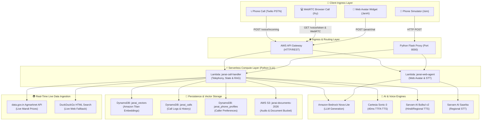

# 🏗️ JanAI — System Architecture & Development Process Guide

This document provides a comprehensive technical overview of **JanAI** — an enterprise-grade, multilingual conversational voice AI platform designed for rural and semi-urban India. 

It covers the complete **End-to-End System Architecture**, **Core Subsystems**, **AI Engine Pipeline**, **Local Development Workflows**, and **Production Deployment Automations**.

---

## 1. 📐 End-to-End System Architecture



---

## 2. 🧩 Core Subsystems & Technical Mechanics

### A. 🎙️ WebRTC Hardware DSP Noise Suppression
* **Location:** [`website/src/utils/audioConstraints.js`](file:///d:/Downloads/JanAI/JanAI/website/src/utils/audioConstraints.js)
* **Mechanics:** Requests microphone access via `getCleanMicrophoneStream()` using strict WebRTC media constraints (`echoCancellation`, `noiseSuppression`, `autoGainControl`, `sampleRate: 16000`, `channelCount: 1`).
* **Benefit:** Activates hardware Digital Signal Processing (DSP) at the browser/OS layer to filter out ambient static, fan noise, and speaker feedback before audio reaches STT.

---

### B. 🌐 Dynamic Language Auto-Detection & Switching
* **Location:** [`lambdas/call_handler/handler.py`](file:///d:/Downloads/JanAI/JanAI/lambdas/call_handler/handler.py#L1691-L1730)
* **Mechanics:** 
  1. **Explicit Signal Detector:** Scans spoken input (in both Devanagari and Roman scripts) for language switch triggers (`in english`, `explain in english`, `english me`, `इन इंग्लिश`, `इंग्लिश में`, `मराठीत`, `தமிழில்`).
  2. **Script Density Classifier:** If no explicit phrase is present, calculates unicode character density (Devanagari `\u0900-\u097F` vs Tamil `\u0B80-\u0BFF` vs Latin).
  3. **Seamless Transition:** When a switch is detected mid-call, updates call state dynamically so the LLM system prompt and TTS speaker switch locale instantly without call interruption.

---

### C. ⚡ 3-Layer Intent & RAG Bypass System
To achieve sub-second conversational latency, the backend avoids unnecessary vector search overhead using a 3-layer structural filter:

```
User Query ──► [Layer 1: Structural Filter (≤3 words / non-question?)] ──► YES ──► Fast-Path Direct LLM (Skip RAG)
                      │
                      NO
                      ▼
               [Layer 2: Bedrock Tag Classifier ([FETCH_DATA]?)] ───────► NO  ──► Fast-Path Direct LLM (Skip RAG)
                      │
                      YES
                      ▼
               [Layer 3: Live Market Check (Mandi/Price/Weather?)] ──────► YES ──► Live API / Web Search (Skip RAG)
                      │
                      NO
                      ▼
               Execute Full Vector Search (DynamoDB + Titan Embeddings)
```

---

### D. 🛑 Telephony Barge-In & Interruption Handling
* **Telephony (Twilio):** Wraps `<Say>` and `<Play>` elements inside `<Gather>` tags in `_append_listen_gather()`. Twilio automatically kills audio playback the moment the caller speaks.
* **Browser Simulator:** [`PhoneSimulatorPage.jsx`](file:///d:/Downloads/JanAI/JanAI/website/src/pages/PhoneSimulatorPage.jsx) tracks active playback resolvers using `activePlaybackResolveRef`. When microphone input is detected during playback, it resolves the promise immediately, breaking execution deadlocks and advancing to speech collection.

---

### E. 🗣️ Multi-Agent Persona Engine
Defined in `AGENT_REGISTRY` in [`handler.py`](file:///d:/Downloads/JanAI/JanAI/lambdas/call_handler/handler.py#L149-L189):

| Agent Name | Persona / Specialty | Default Voice Engine | Gender Prompt Enforcement |
|---|---|---|---|
| **Arya** | Government Schemes, General Knowledge & Friendly Chat | Cartesia / Sarvam Vidya (English), Arya (Hindi) | Feminine verb forms (*karti hu, bol rahi hu*) |
| **Hitesh** | Agriculture, Mandi Prices, Farming & Crop Insurance | Sarvam Abhilash / Hitesh | Masculine verb forms (*karta hu, bol raha hu*) |
| **Vidya** | Healthcare, ASHA Services, Mental Wellness | Cartesia / Sarvam Vidya | Feminine verb forms (*karti hu, bol rahi hu*) |

---

## 3. 🛠️ Development & Deployment Process Workflow

### A. 💻 Local Development Workflow
1. **Python Local Server (`scripts/local_server.py`):**
   * Wraps both Lambda handlers (`call_handler` and `web_agent`) inside a Flask application listening on `http://localhost:8000`.
   * Maps routes `/voice/*`, `/chat`, `/call/initiate`, and `/janai/*`.
2. **React Frontend Server (`cd website && npm run dev`):**
   * Vite development server listening on `http://localhost:5173`.
   * Configured via `website/.env.local` to direct REST API calls to `http://localhost:8000`.
3. **Browser Simulator (`http://localhost:5173/sim`):**
   * Executes TwiML XML node loops locally in browser memory.
   * Zero Twilio credits consumed during local testing.

---

### B. 🚀 Production Deployment Automations

#### 1. AWS Lambda Backend Deployment (`scripts/deploy.ps1`)
We created a 1-command PowerShell script [`scripts/deploy.ps1`](file:///d:/Downloads/JanAI/JanAI/scripts/deploy.ps1) that handles packaging and deployment automatically:

```powershell
# Usage:
powershell -ExecutionPolicy Bypass -File scripts\deploy.ps1
```

**Deployment Mechanics:**
1. Bundles `handler.py` and `connect_handler.py` with pure-Python dependencies (`requests`, `twilio`, `jwt`, `certifi`, etc.) from the virtual environment.
2. Zips the bundle and uploads it to S3 bucket `s3://janai-documents-2026/deployments/`.
3. Calls `aws lambda update-function-code --s3-bucket ... --s3-key ...`. Using S3 multipart chunking prevents connection timeout errors during uploads.
4. Invokes `aws lambda wait function-updated` to ensure activation.

#### 2. React Frontend Vercel Deployment
```powershell
cd website
vercel --prod
```
* Compiles production assets via `vite build` into `/dist`.
* Deploys directly to Vercel global CDN (`https://janai-beta.vercel.app`).

---

### C. ⏪ Rollback & Versioning Strategy
1. **Git Rollback Point:**
   Every major milestone is committed locally (`git commit -m "..."`). Reverting backend code to a specific state:
   ```powershell
   git checkout <COMMIT_HASH> -- lambdas/call_handler/handler.py
   powershell -ExecutionPolicy Bypass -File scripts\deploy.ps1 -CallHandler
   ```
2. **Vercel Instant Rollback:**
   In [Vercel Dashboard](https://vercel.com/dashboard) $\rightarrow$ `janai` project $\rightarrow$ **Deployments** $\rightarrow$ **Promote to Production** (takes 10 seconds).
